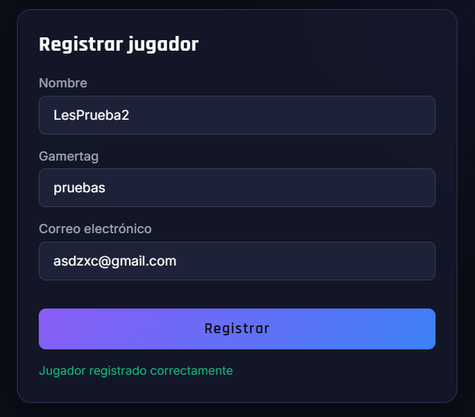
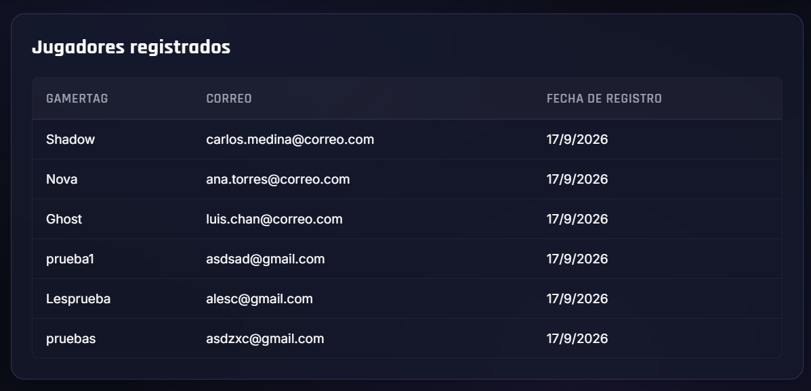
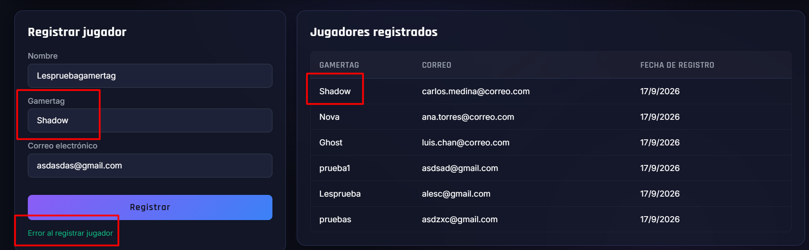
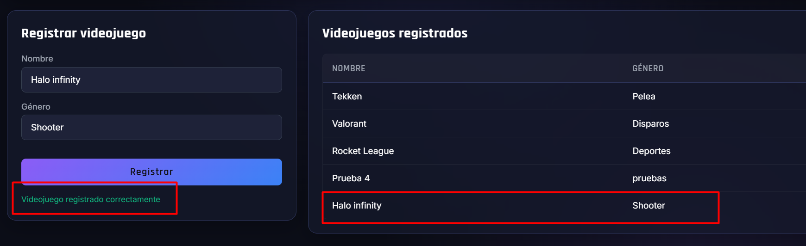
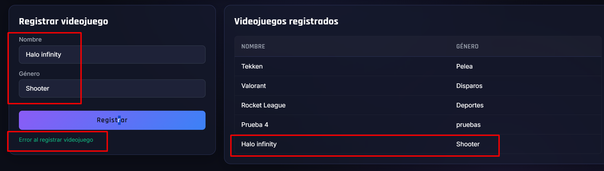
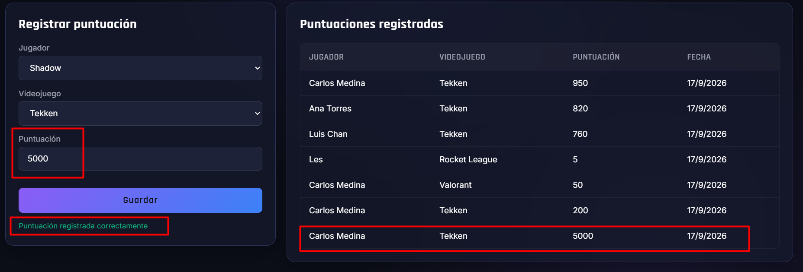
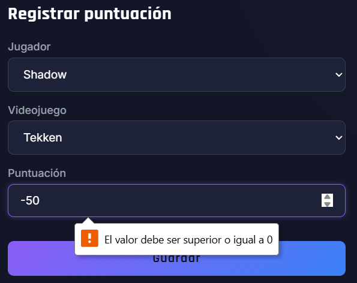
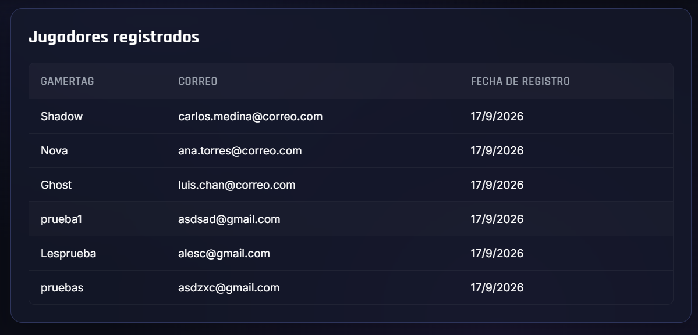
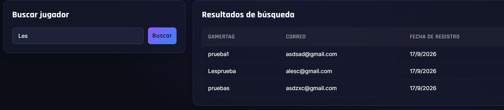
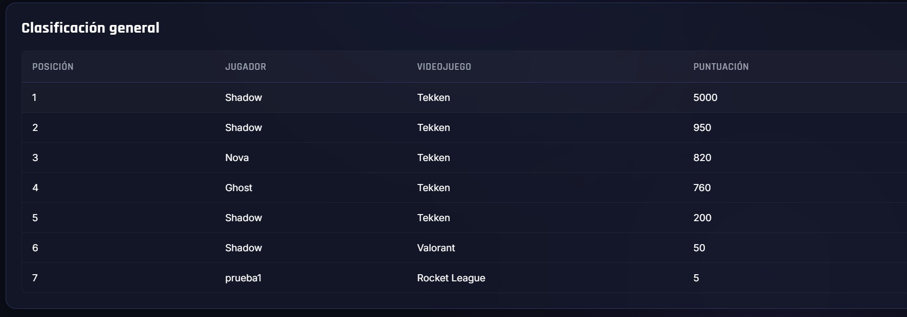

# Reporte de Pruebas Funcionales (QA)

**Proyecto:** Sistema de Gestión de Torneo de Videojuegos  
**Responsable de Pruebas:** Lester David Uicab Gongora  
**Fecha de Ejecución:** 17 de Septiembre de 2026  
**Resultado Global:** Aprobado

---

### Caso 1: Registro correcto de jugador
* **Objetivo:** Comprobar la inserción de un nuevo jugador en la base de datos y su despliegue en la interfaz.
* **Acción realizada:** Se ingresaron datos válidos en el formulario de la pestaña Jugadores y se envió.
* **Resultado:** El sistema confirmó el registro con código 201 y el participante apareció en la tabla.
* **Estado:** PASS

(img/caso-01-1.png)

---

### Caso 2: Intento de Gamertag duplicado
* **Objetivo:** Validar que se respete la restricción de valor único en el Gamertag.
* **Acción realizada:** Se intentó registrar a otro jugador con un Gamertag ya existente.
* **Resultado:** El sistema rechazó la inserción y mostró el mensaje de error correspondiente.
* **Estado:** PASS

---

### Caso 3: Registro correcto de videojuego
* **Objetivo:** Verificar la creación exitosa de un videojuego en el catálogo.
* **Acción realizada:** Se capturaron Nombre y Género válidos y se pulsó Registrar.
* **Resultado:** El juego se almacenó y se listó en la tabla de videojuegos.
* **Estado:** PASS

---

### Caso 4: Intento de videojuego duplicado
* **Objetivo:** Comprobar que no se permitan títulos repetidos.
* **Acción realizada:** Se intentó guardar un videojuego cuyo nombre ya estaba registrado en la base de datos.
* **Resultado:** La petición fue rechazada evitando duplicar el registro.
* **Estado:** PASS

---

### Caso 5: Registro correcto de puntuación
* **Objetivo:** Asociar una partida vinculando jugador, videojuego y puntuación.
* **Acción realizada:** Se seleccionaron los datos en los selectores y se ingresó una puntuación positiva.
* **Resultado:** La partida se guardó con fecha actual y se agregó a la tabla de puntuaciones.
* **Estado:** PASS

---

### Caso 6: Intento de puntuación negativa
* **Objetivo:** Validar la regla de negocio que prohíbe puntuaciones menores a cero.
* **Acción realizada:** Se ingresó un valor negativo (-50) en el formulario de puntuación.
* **Resultado:** La validación bloqueó el envío indicando que el valor debe ser mayor o igual a 0.
* **Estado:** PASS

---

### Caso 7: Consulta de jugadores
* **Objetivo:** Verificar la lectura de todos los participantes registrados.
* **Acción realizada:** Se navegó a la pestaña Jugadores para cargar la lista.
* **Resultado:** La tabla desplegó a todos los competidores con Gamertag, correo y fecha de alta.
* **Estado:** PASS

---

### Caso 8: Búsqueda por nombre o Gamertag
* **Objetivo:** Evaluar la funcionalidad del buscador en tiempo real.
* **Acción realizada:** Se escribió un Gamertag en la caja de búsqueda y se presionó Buscar.
* **Resultado:** La tabla filtró y mostró únicamente la fila correspondiente al jugador consultado.
* **Estado:** PASS

---

### Caso 9: Orden correcto del ranking
* **Objetivo:** Confirmar que la tabla ordene las posiciones de mayor a menor puntuación.
* **Acción realizada:** Se accedió a la sección de Ranking.
* **Resultado:** La primera posición se asignó al puntaje más alto, seguido de los demás en orden descendente.
* **Estado:** PASS

---

### Caso 10: Cálculo de estadísticas
* **Objetivo:** Validar las métricas y operaciones del panel general.
* **Acción realizada:** Se consultó la sección de Estadísticas del torneo.
* **Resultado:** Las tarjetas reflejaron la suma exacta de jugadores, juegos, partidas y el promedio general.
* **Estado:** PASS

